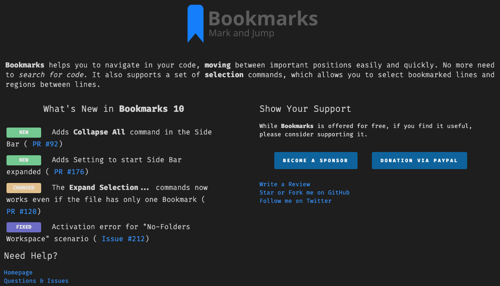

# What's New

This module is a template based engine, used to display a **What's New** page on VS Code extensions. It has a simple, but yet effective UI, optimized to display all the information in a single page.



## Usage

```ts

// provide the data

import { ChangeLogItem, ChangeLogKind, ContentProvider, Header, Image } from "../../vscode-whats-new/src/ContentProvider";

export class WhatsNewDelphiKeybindingsContentProvider implements ContentProvider {

    provideHeader(logoUrl: string): Header {
        return <Header>{logo: <Image> {src: logoUrl, height: 50, width: 50}, 
            message: `<b>Project Manager</b> helps you to easily access your <b>projects</b>,
            no matter where they are located. <i>Don't miss that important projects anymore</i>.`};
    }

    provideChangeLog(): ChangeLogItem[] {
        let changeLog: ChangeLogItem[] = [];
        changeLog.push({kind: ChangeLogKind.NEW, message: "Adds an all-new Project Manager <b>Side Bar</b>"});
        changeLog.push({kind: ChangeLogKind.NEW, message: "Adds <b>Remote Development</b> support"});
        changeLog.push({kind: ChangeLogKind.FIXED, message: `The projects in the <b>Side Bar</b> should not be sorted case-sensitive (<a title=\"Open Issue #243\" 
            href=\"https://github.com/alefragnani/vscode-project-manager/issues/243\">
            Issue #243</a>)`});
        return changeLog;
    }
}

// register the provider
const provider = new WhatsNewProjectManagerContentProvider();
const viewer = new WhatsNewManager(context).registerContentProvider("project-manager", provider);
// show the page (if necessary)
viewer.showPageInActivation();

// register the additional command (not really necessary, unless you want a command registered in your extension)
context.subscriptions.push(vscode.commands.registerCommand("projectManager.whatsNew", () => viewer.showPage()));
```
## Features

### Detects version updates

The module follows [SEMVER - Semantic Versioning](https://www.semver.org), detecting **Major**, **Minor** and **Patch** versions. The **What's New** page will only be displayed when a **Major** or **Minor** update occurs. **Patches** are silent.

### Template Based

There is not need to deal with HTML or CSS for updating the page's content. Simply _provides_ the relevant information and the HTML page is automatically generated.

### Dark and Light Themes support

Ready for both Dark and Light themes

## Inspiration

The idea to this module came from the [GitLens extension](https://marketplace.visualstudio.com/items?itemName=eamodio.gitlens) (big thanks to Eric Amodio :claps:). Based on pieces of its welcome page, this template based engine was created, and now can be used by any extension.

# License

[MIT](LICENSE.md) &copy; Alessandro Fragnani